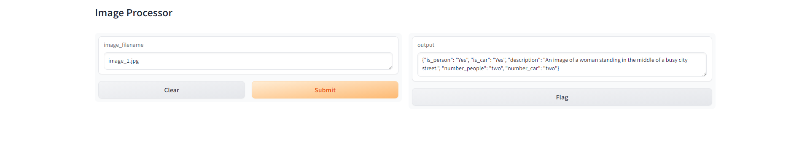

The selected *Visual Language Model* is pre-trained Deep Learning-based model, [KOSMOS-2](https://huggingface.co/docs/transformers/main/en/model_doc/kosmos-2), from Hugging Face.

A gradio app has been dockerized. This app receives an image filename and outputs a json with five fields: {is_person: Yes/No, is_car: Yes/No, description: visual description of the image, "number_people": people counting, "number_car":car counting}.

The main dependencies are: NLTK (natural language processing-NLP), transformers (NLP and computer vision), re (text matching), Pillow (image processing), and gradio (Machine Learning app dev).

    

    

